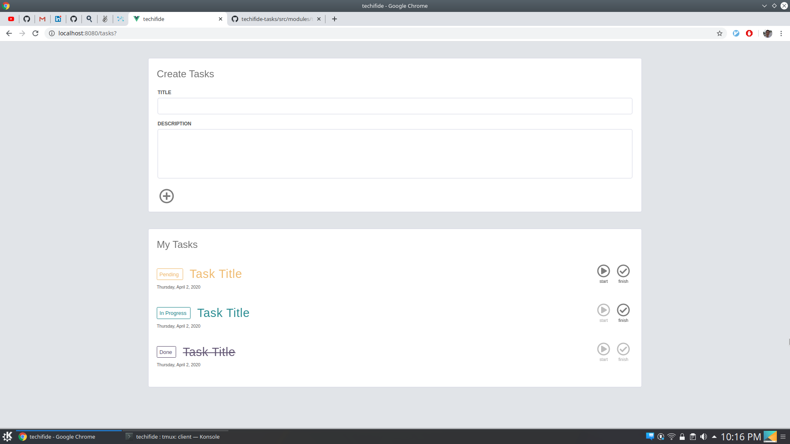

# Techifide Frontend Assessment

A simple task manager client developed in [Vue.js](https://vuejs.org/) that uses `mocked-data` to interact with interfaces.
The big deal here is providing some informations about how I think about development: spliting concerns, projecting architeture and making use of computer science concepts.

Requirements are available [here](./docs/assessment.pdf).

## Prerequisites

[Node](https://nodejs.org/en/) +12 and [Yarn](https://yarnpkg.com/) 1.22.4

All commands described in this document should be executed from the project's root directory.

## Getting Started

Clone the repo, install all project's dependencies with `yarn install`, and run `yarn serve`. When it's done building, the app is accessible from `localhost:8080`.
